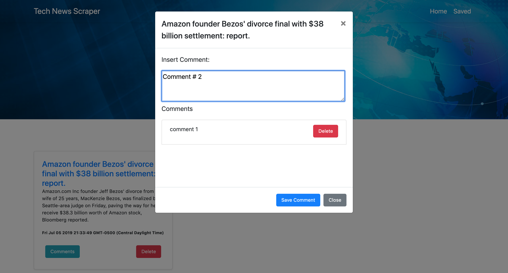

# Project Title

Tech News Scraper

## What the project does

A full stack app that scrapes Technology articles from Reuters and let users comment on each saved article.

## Screenshots / Demo

  

Option to comment on each headline/article.  

## Why the project is useful

With a nice GUI the app allow users access to the latest Tech News, save interesting headlines to maybe read later on and to comment any important idea on the saved articles for a later reference.

## How does it works

If there are no shown articles, the user needs to hit the Scrape 'Em All button to get the articles, at this point all articles will be displayed with the option to save articles. Once the user has saved some articles they need to navigate to the Saved Page where they will find their previously selected articles with the option to: 1)comment and delete previous comments on each article and 2)to delete the article.

## How can I use it

There are two ways to test this:

* The easy way: just go to the app page and test it! --> [Top Tech News](hyperlink).
* The not that easy way: you would need to clone/download the repository and install the necessary dependencies with the command “npm install” and do not forget about the DB settings.

## Where users can get help with your project - Built With:

* [HTML](https://developer.mozilla.org/en-US/docs/Web/HTML)
* [CSS](https://developer.mozilla.org/en-US/docs/Web/CSS)
* [Javascript](https://www.javascript.com/)
* [jQuery](https://jquery.com/)
* [NodeJs](https://nodejs.org/en/)
* [Express](https://www.npmjs.com/package/express)
* [Bootstrap](https://getbootstrap.com/)
* [MongoDB](http://mongodb.github.io/node-mongodb-native/)
* [Mongoose](https://mongoosejs.com/)
* [Axios](https://www.npmjs.com/package/axios)
* [Cheerio](https://www.npmjs.com/package/cheerio)

## Who maintains and contributes to the project - Author:

* **Sergio Rodriguez** - [sergioardz](https://github.com/sergioardz)

## License

This project is licensed under the MIT License - see the [LICENSE.md](LICENSE.md) file for details

## URLS

* [Github project](https://github.com/sergioardz/news-scraping)
* [Heroku project](hyperlink)